# 写在前面

就在上周，我作为讲师参与了2023RT-Thread全球技术峰会的主题演讲，我给大家带来了一套全新的解决物联网终端应用多样化的软件架构解决方案，在这里我再次以图文的形式介绍一下给社区的小伙伴，希望借此机会找到更多的同频小伙伴。

如果你也对此项目感兴趣，欢迎加我VX：721317716，一起深入探讨物联网应用的乐趣。


# 简介

xiotman，它是一套致力于解决物联网终端应用多样化挑战的软件架构解决方案。详见 [github仓库](https://github.com/recan-li/xiotman) 或 [gitee仓库](https://gitee.com/recan-li/xiotman)  。


# xiotman的架构

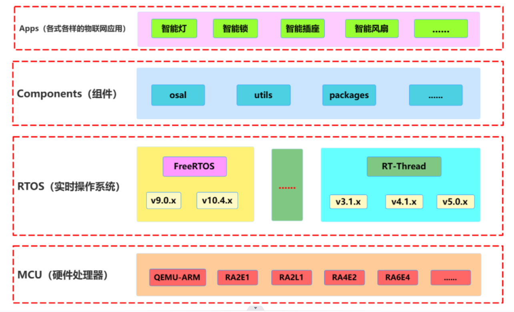


# xiotman的特点

- 应用的多样性：支持多应用开发 
- 组件的多样性：支持多组件解耦 
- RTOS的多样性：支持多RTOS 
- MCU的多样性：支持多MCU


# xiotman的目录结构

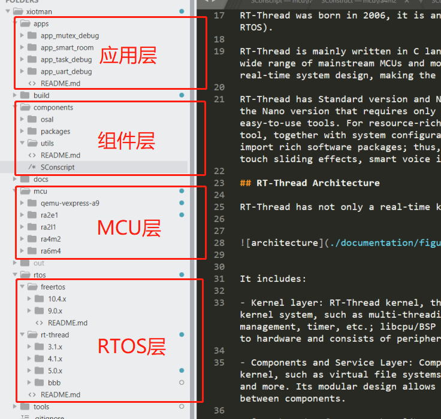

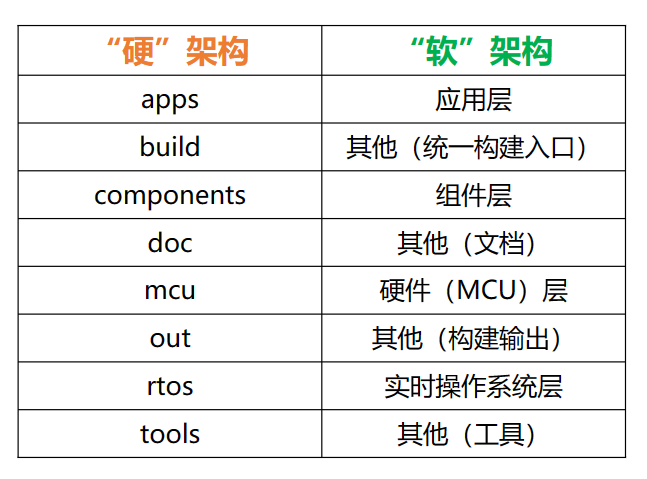


# 资源文档

## 硬件支持

- **qemu-vexpress-a9**
- **RA2E1**
- **RA2L1**
- **RA4M2**
- **RA6M4**

更多的硬件芯片支持中 ......


## 实时操作系统支持

- **FreeRTOS**
  - V9.0.x （**待支持**）
  - V10.4.x （**待支持**）
- **RT-Thread**
  - V3.1.x （**待支持**）
  - V4.1.x （**待支持**）
  - V5.0.x （**已支持**）
  - nano （**待支持**）
  - rt-smart （**待支持**）

更多的操作系统（版本）支持中 ......


## 开发环境支持

- Windows下：env + scons +gcc  （**已验证**）
- Linux下：（**待验证**）
- MacOS下：（**待验证**）


## 文档

> 待进一步补充。。。


## 例程

目前默认的仓库代码下，主要支持了 **app_uart_debug** 应用，和 **app_smart_room** 应用（基于RA4M2），其他demo应用还在进一步完善中。

其他 **app_uart_debug** 应用如下：

```c
int app_main_entry(void *arg)
{
	uint32_t cnt = 0;

    rt_kprintf("\nHello XIoTMan@RT-Thread !\n");
    
    while (1)
    {
        rt_thread_mdelay(1000);
        rt_kprintf("cnt ---> === 666666 ...... %d\r\n", ++cnt);
    }

    return 0;
}
```


## **快速上手**

xiotman 中支持选用 **qemu-vexpress-a9** 这块MCU，与QEMU硬件模拟，快速地调试和使用xiotman框架。

[QEMU 入门指南(Windows)](documentation/quick-start/quick_start_qemu/quick_start_qemu.md)

[QEMU 入门指南(Ubuntu)](documentation/quick-start/quick_start_qemu/quick_start_qemu_linux.md)

以下操作步骤可以帮助你，快速在PC环境模拟运行，以Windows为例：

1. 安装好env环境和scons工具；
2. 启动env环境，进入到 **xiotman/build** 目录；
3. 执行 `scons --list_app` 查看当前选择编译的应用、MCU、RTOS版本等信息；

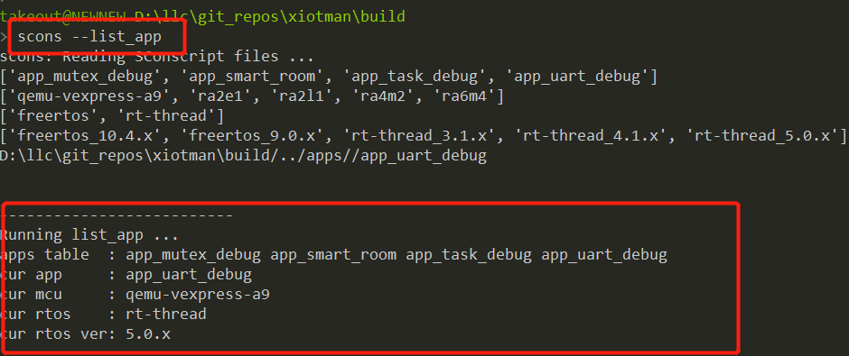

4. 执行 `scons --menuconfig=build` 选择对应的应用、MCU及RTOS版本，默认的情况下，选择的是 app_uart_debug应用、qemu-vexpress-a9、rt-thread-v5.0.x版本；

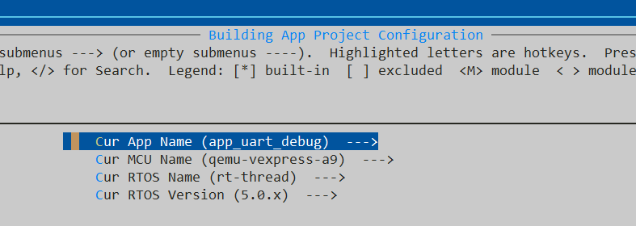

5. 执行 `scons --clean` 清除当前选择的应用的中间编译输出；

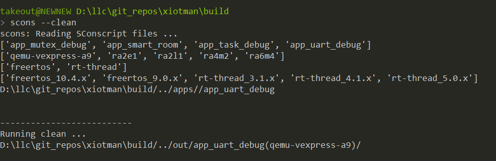

6. 执行 `scons` 开始编译当前应用；

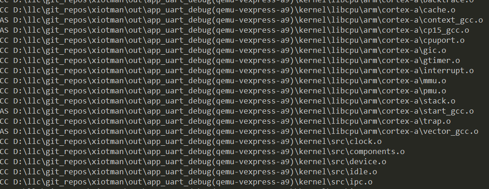

7. 成功完成编译后，在 `xiotman/out/app_uart_debug(qemu-vexpress-a9)/` 目录可以看到对应的固件文件输出；

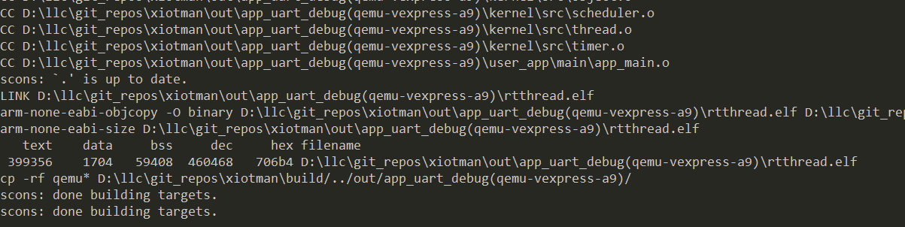

8. 执行编译输出的固件；进入到 `xiotman/out/app_uart_debug(qemu-vexpress-a9)/` 目录，执行 `./qemu-nographic.bat` 即可运行；

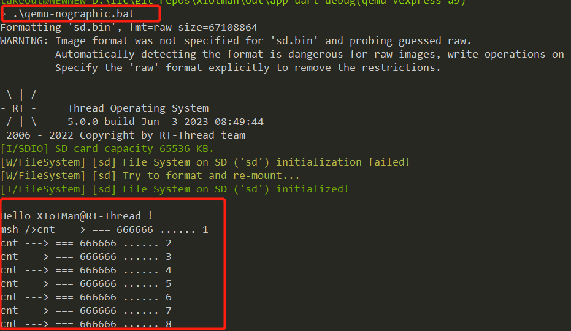

这里的运行与 `app_uart_debug ` 的应用逻辑是一致的：

```c
int app_main_entry(void *arg)
{
	uint32_t cnt = 0;

    rt_kprintf("\nHello XIoTMan@RT-Thread !\n");
    
    while (1)
    {
        rt_thread_mdelay(1000);
        rt_kprintf("cnt ---> === 666666 ...... %d\r\n", ++cnt);
    }

    return 0;
}
```


至此，已经完成了xiotman在PC环境的验证，如果需要编译其他应用或其他MCU平台的代码，只需要回到build目录，执行 `scons --menuconfig=build` 即可选择；同时xiotman还保留了原生的 `RTOS` 的配置，执行 `scons --menuconfig=rtos` 即可进入配置：

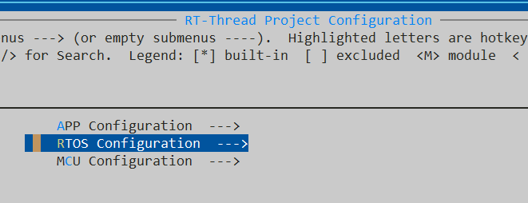

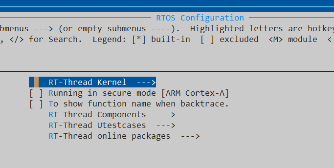


## 演示视频

参见B站视频：[【xiotman 基础功能演示】]( https://www.bilibili.com/video/BV1xm4y147vN/?share_source=copy_web&vd_source=b81cd689c31728c97b1f10f2ac4acd2d)


# **许可协议**

xiotman 系统完全开源，遵循 Apache License 2.0 开源许可协议，可以免费在商业产品中使用，并且不需要公开私有代码，没有潜在商业风险。


# 社区支持

本项目由 [架构师李肯](http://yyds.recan-li.cn) 的独家个人社区（[架构师李肯带你学嵌入式](https://bbs.csdn.net/forums/recan-iot?typeId=2920953)）进行维护，欢迎加入我们的社区，了解更多。


# 贡献代码

如果您对 **xiotman** 感兴趣，并希望参与 **xiotman** 的开发并成为代码贡献者，请扫描下方的二维码，与我取得联系。


# 文末福利

在直播当天，我在我的 **嵌入式高质量技术交流群** 里包邮送出了三本《**RT-Thread设备驱动开发指南**》实体书，好巧不巧，其中一位中奖的朋友已经拥有且看过这本书了，于是我们共同决定把这本书的福利让利给 **RT-Thread技术社区** 的朋友。由于赠书目前只剩下一本，所以我们定了一个规则：

- **第一位对本文回复并点赞的，获得赠书资格**；
- **拿到赠书后，需要在RT-Thread官方技术社区和架构师李肯的技术社区同步发表至少2篇读后感**；
- 承诺做到上面第2点的，第一时间添加我VX：721317716 登记赠送。

感谢大家的关注，如果大家对嵌入式的技术讨论感兴趣也欢迎与我联系，我们每天都会开展热议话题讨论：职场、技术、人生、面试、晋升；你感兴趣的话题也许都在里面。我们的口号是：**在扯淡中放松自己，在摸鱼中学点东西** 。
