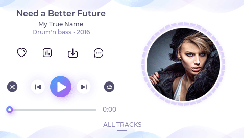

# Music Player Demo for RT-Thread

# LVGL音乐播放器演示示例（RT-Thread定制版）

## Overview
The music player demo shows what kind of modern, smartphone-like user interfaces can be created on LVGL. It works the best with display with 480x272 or 272x480 resolution. 




## 如何使用这个Demo

- 在`lv_conf.h`中增加宏定义`#define LV_USE_DEMO_RTT_MUSIC 1 `

- 如果想要自动播放的话，可以增加宏定义`#define LV_DEMO_RTT_MUSIC_AUTO_PLAY 1`

- 如果想要让demo循环反复播放，需要增加宏定义`#define LV_DEMO_RTT_MUSIC_AUTO_PLAY_FOREVER 1` （如果不定义这个，在只定义 `#define LV_DEMO_RTT_MUSIC_AUTO_PLAY 1` 的情况下，默认是自动播放40秒，显示平均FPS结果，然后停住）

- `lv_conf.h`文件涉及到本demo的宏定义配置示例：

  ```c
    /* music player demo */
    #include <rtconfig.h>
    
    #define LV_HOR_RES_MAX              LCD_WIDTH
    #define LV_VER_RES_MAX              LCD_HEIGHT
    #define LV_USE_DEMO_RTT_MUSIC       1
    #define LV_DEMO_RTT_MUSIC_AUTO_PLAY 1
    #define LV_FONT_MONTSERRAT_12       1
    #define LV_FONT_MONTSERRAT_16       1
    #define LV_COLOR_SCREEN_TRANSP      1
  ```
  
- 调用`lv_demo_music()`函数：[例程](https://github.com/RT-Thread/rt-thread/blob/master/bsp/stm32/stm32f469-st-disco/applications/lvgl/demo/lv_demo.c)

  ```c
  void lv_user_gui_init(void)
  {
      extern void lv_demo_music(void);
      lv_demo_music();
  }
  ```

## How the spectrum animation works
- `assets/spectrum.py` creates an array of spectrum values from a music. 4 band are created with 33 samples/sec: bass, bass-mid, mid, mid-treble.
- The spectrum meter UI does the followings:
	- Zoom the album cover proportionality to the current bass value
	- Display the 4 bands on the left side of a circle by default at 0°, 45°, 90°, 135°
	- Add extra bars next to the "main bars" with a cosine shape. Add more bars for the lower bands.
	- If there is a large enough bass, add a random offset to the position of the bars. E.g. start from 63° instead of 0°. (bars greater than 180° start again from 0°)
	- If there is no bass, add 1 to the offset of the bars (it creates a "walking" effect)
	- Mirror the bars to the right side of the circle
	
## Using spectrum.py
- install `librosa` with `pip3 install librosa`	
- run `python sectrum.py my_file.mp3`
- see the result in `spectrum.h`
