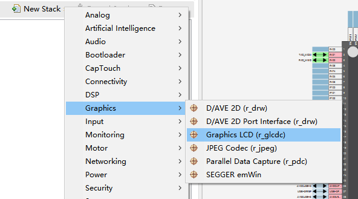
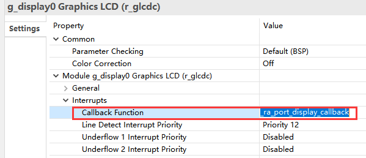
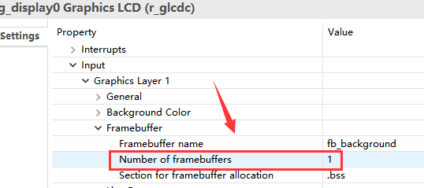
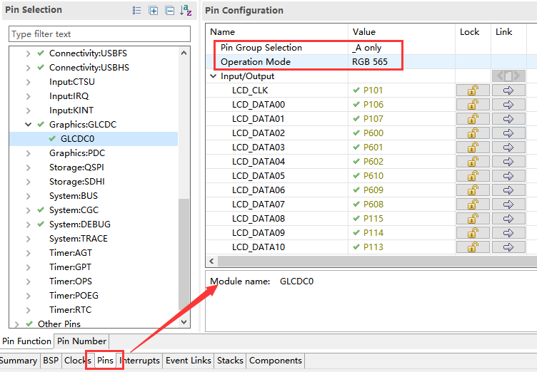
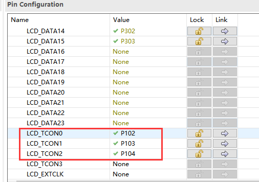
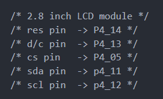
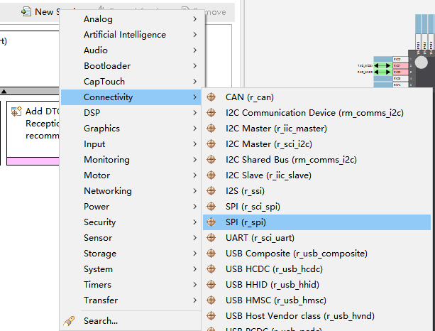
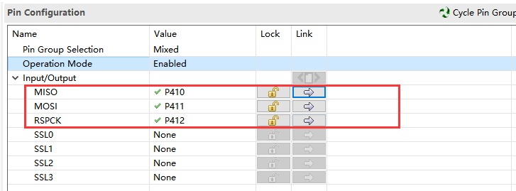

# RA6M3-HMI-Board-lvgl 使用文档

## ENV 配置

首先在BSP目录下打开env工具，输入 `menuconfig` 进入配置界面

## RGB 屏使用配置

在 `Hardware Drivers Config → On-chip Peripheral Drivers → Enable LVGL for LCD` 中使能 `Enable LVGL for LCD_RGB565` 选项

接下来退出菜单界面，输入 `pkgs --update` 命令手动联网获取 lvgl 的软件包到 `packages` 文件夹下

接着在env 终端中输入 `scons --target=mdk5` 生成 mdk 工程

### fsp 中配置 GLCDC 外设

点击 mdk 中的 `Tools->RA Smart Configurator` 进入 rasc 配置软件

点击 New Stack，选择 `Graphics->Graphics LCD`，使能 LCD 外设

在 `Interrupt->Callback Function` 中，设置中断回调函数，输入 ：`_ra_port_display_callback`

在 `Input->Graphics Layer 1->Framebuffer` 中，将 `Number of framebuffers` 属性设置为1，其他选项默认

接着我们配置 LCD 的引脚属性，进入 Pins 界面按照下图进行配置：

接着向下拉，按照下图配置 LCD_TCONx 引脚：

完成以上配置后，点击 `Generate Project Content` 生成配置相关代码

### 编译烧录

退出 rasc 后，在 mdk 中进行编译，仿真下载即可

## SPI(ILI9431) 屏使用配置

### 硬件连接

硬件按照如下引脚进行连接：

在 `Hardware Drivers Config → On-chip Peripheral Drivers → Enable LVGL for LCD` 中使能 `Enable LVGL for LCD_ILI9431` 选项

接下来退出菜单界面，输入 `pkgs --update` 命令手动联网获取 lvgl 的软件包到 `packages` 文件夹下

接着在env 终端中输入 `scons --target=mdk5` 生成 mdk 工程

### fsp 中配置 SPI 外设

点击 mdk 中的 `Tools->RA Smart Configurator` 进入 rasc 配置软件

点击 New Stack，选择 `Connectivity->SPI(r_spi)`，使能 SPI 外设

在 `Callback` 中，设置中断回调函数，（默认使用SPI0）输入 ：`spi0_callback`

接着我们配置 SPI 的引脚属性（默认使用SPI0），进入 Pins 界面按照下图进行配置：

完成以上配置后，点击 `Generate Project Content` 生成配置相关代码

### 编译烧录

退出 rasc 后，在 mdk 中进行编译，仿真下载即可

